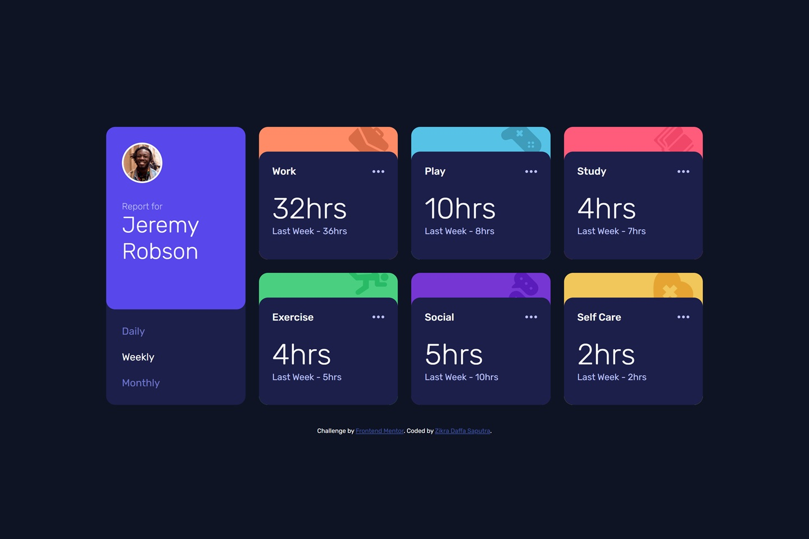

# Frontend Mentor - Time Tracking Dashboard Solution

This is my solution to the **Time Tracking Dashboard** challenge on Frontend Mentor. The objective of this project is to recreate a responsive time-tracking dashboard while practicing React component composition, state management, dynamic rendering from JSON data, and responsive layouts.

## Preview



## Links

- **Live Site:** https://shrigel.github.io/time-tracking-dashboard/
- **Frontend Mentor Challenge:** https://www.frontendmentor.io/challenges/time-tracking-dashboard-UIQ7167Jw

## Built With

- React 19
- Vite
- JavaScript (ES6+)
- SCSS / Sass
- CSS Grid
- Flexbox
- CSS Custom Properties
- Responsive Design
- React Hooks (`useState`)
- Local JSON Data
- Google Fonts (Rubik)

## Layout

The original design was created for the following viewport widths:

- **Mobile:** 375px
- **Desktop:** 1440px

The dashboard uses a responsive CSS Grid layout. On mobile devices, all cards are displayed in a single column. On larger screens, the profile card spans two rows while the activity cards form a four-column dashboard layout that matches the original design.

## Style Guide

### Colors

#### Primary

| Color | HSL |
|--------|-----|
| Purple 600 | `hsl(246, 80%, 60%)` |
| Work (Orange 300) | `hsl(15, 100%, 70%)` |
| Play (Blue 300) | `hsl(195, 74%, 62%)` |
| Study (Pink 400) | `hsl(348, 100%, 68%)` |
| Exercise (Green 400) | `hsl(145, 58%, 55%)` |
| Social (Purple 700) | `hsl(264, 64%, 52%)` |
| Self Care (Yellow 300) | `hsl(43, 84%, 65%)` |

#### Neutral

| Color | HSL |
|--------|-----|
| Navy 950 | `hsl(226, 43%, 10%)` |
| Navy 900 | `hsl(235, 46%, 20%)` |
| Purple 500 | `hsl(235, 45%, 61%)` |
| Navy 200 | `hsl(236, 100%, 87%)` |

### Typography

**Body Copy**

- Card title font size: **18px**

**Font**

- **Family:** [Rubik](https://fonts.google.com/specimen/Rubik)
- **Weights:** 300, 400, 500

## Project Structure

```text
├── public
│   └── favicon-32x32.png
├── src
│   ├── assets
│   │   ├── data
│   │   │   └── data.json
│   │   └── images
│   │       ├── icon-ellipsis.svg
│   │       ├── icon-exercise.svg
│   │       ├── icon-play.svg
│   │       ├── icon-self-care.svg
│   │       ├── icon-social.svg
│   │       ├── icon-study.svg
│   │       ├── icon-work.svg
│   │       └── image-jeremy.png
│   ├── components
│   │   ├── ActivityCard.jsx
│   │   ├── Footer.jsx
│   │   └── ProfileCard.jsx
│   ├── css
│   │   ├── App
│   │   │   ├── App.css
│   │   │   ├── App.css.map
│   │   │   └── App.scss
│   │   └── index
│   │       ├── index.css
│   │       ├── index.css.map
│   │       └── index.scss
│   ├── App.jsx
│   └── main.jsx
├── eslint.config.js
├── index.html
├── package-lock.json
├── package.json
├── preview.jpg
├── README.md
└── vite.config.js
```

## React Components

The application is split into reusable React components, making the dashboard easier to maintain and extend.

| Component | Responsibility |
|-----------|----------------|
| `ProfileCard` | Displays the user profile and timeframe controls |
| `ActivityCard` | Renders each activity with its current and previous hours |
| `Footer` | Displays the attribution section |

The main application renders the activity cards dynamically:

```jsx
{data.map((activity) => (
  <ActivityCard
    key={activity.title}
    activity={activity}
    timeFrame={timeFrame}
  />
))}
```

This allows every card to reuse the same component while displaying different data.

## State Management

The selected timeframe is managed with React's `useState`.

```jsx
const [timeFrame, setTimeFrame] = useState('weekly');
```

The selected value is passed to both components:

- `ProfileCard` updates the selected timeframe.
- `ActivityCard` displays the corresponding data.

The active button styling is controlled by React state:

```jsx
<button
  className={timeFrame === 'daily' ? 'active' : ''}
  onClick={() => setTimeFrame('daily')}
>
  Daily
</button>
```

## Dynamic JSON Data

Instead of hardcoding each activity card, the dashboard reads data from `data.json`.

Each activity contains multiple timeframes:

```json
{
  "title": "Work",
  "timeframes": {
    "daily": {
      "current": 5,
      "previous": 7
    }
  }
}
```

The displayed values update automatically based on the selected timeframe.

## Responsive Dashboard Layout

The desktop layout uses CSS Grid to recreate the original design.

```scss
.dashboard-container {
    grid-template-columns: repeat(4, 1fr);
}
```

The profile card spans two rows:

```scss
.profile-card {
    grid-row: span 2;
}
```

This creates the characteristic asymmetric dashboard while keeping the mobile layout as a single-column grid.

## SCSS

The project uses **SCSS** as the primary styling source.

The SCSS files are compiled into CSS while preserving source maps for easier debugging.

SCSS nesting is used extensively to keep component styles organized.

Example:

```scss
.activity-card {
    .activity-content {
        &:hover {
            background-color: var(--purple-500);
        }
    }
}
```

The project also uses CSS Custom Properties for reusable colors:

```scss
.work {
    --accent-color: var(--work-orange);
}

.play {
    --accent-color: var(--play-blue);
}
```

Each activity card inherits its accent color through the same reusable component.

## What I Practiced

Through this project, I practiced:

- Building a responsive dashboard with React.
- Creating reusable components for repeated UI patterns.
- Managing application state with `useState`.
- Rendering data dynamically from a JSON file.
- Combining CSS Grid and Flexbox in the same layout.
- Organizing styles with SCSS nesting.
- Using CSS Custom Properties for reusable theme colors.
- Implementing active states and hover interactions.
- Structuring a Vite project with reusable components and assets.

## Author

- GitHub - [@shrigel](https://github.com/shrigel)
- Frontend Mentor - [@shrigel](https://www.frontendmentor.io/profile/shrigel)